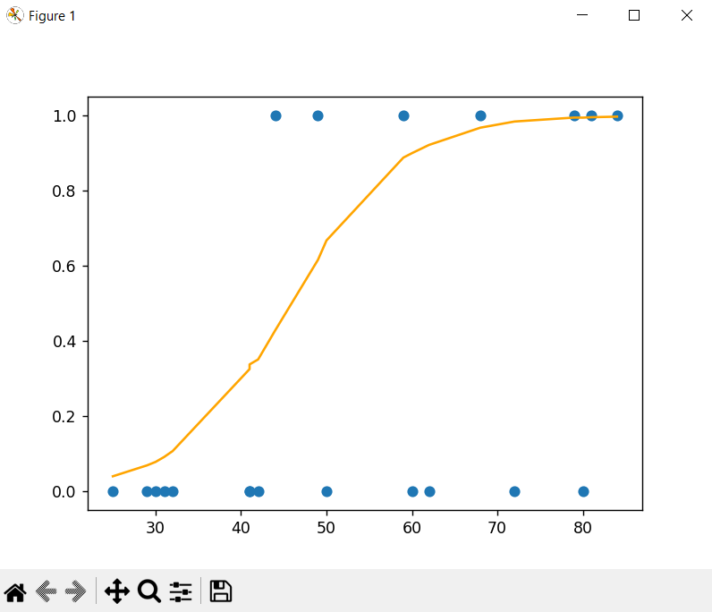

<h1>PSPPR solutions in one branch.</h1>

Ассоциативные правила

Алгоритм К-средних

Алгоритм DBSCAN

Наивный Байесовский
классификатор с нормальным распределением

Линейная регрессия

Логистическая регрессия

